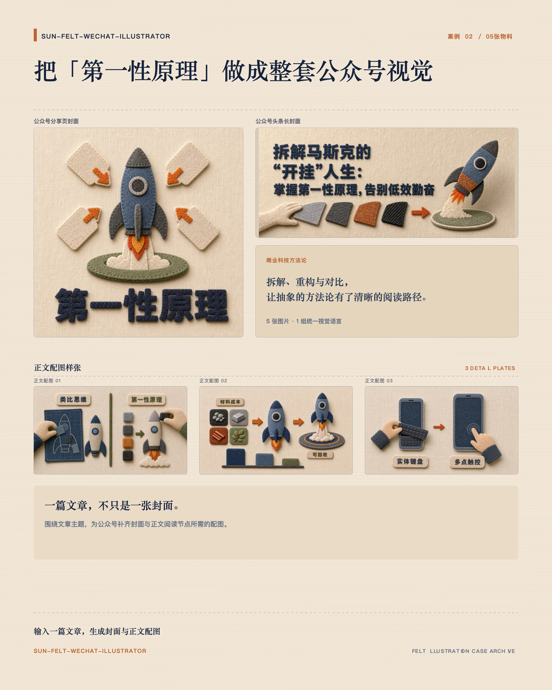

# sun-felt-wechat-illustrator

> 把一篇中文公众号文章，做成一套真实 3D 毛毡质感的视觉：头条长封面、分享页方形封面，以及真正帮助读者理解正文的配图。

[](./LICENSE)


`sun-felt-wechat-illustrator` 是一个面向 Codex 的中文内容视觉 Skill。给它一篇文章、Markdown 或正文，它会先理解文章要帮助读者完成的任务，再输出成组、同一视觉语言的公众号图片，而不是只生成一张“好看但无关”的插图。

## 你会得到什么

- 一张约 **2.35:1** 的公众号头条长封面
- 一张 **1:1** 的分享页封面
- 按文章真实理解节点推荐的正文配图：默认 **16:9**；用户明确指定时也支持 **4:3** 或 **3:4**
- 每张正文图的精确插入提示：放在原文哪一句之后
- 可追溯的 `plan.md`、提示词、质检记录与 `placement-guide.md`

默认交付是一套完整视觉；也可以明确要求只做封面、只做方形封面，或只生成指定数量的正文图。

## 为何不是“再生成几张图”

公众号配图的价值不在于填满版面，而在于让读者更快理解、区分、记住或行动。本 Skill 会先路由文章体裁、核心命题、情绪与风险，再为每一张图定义一个独立的“读者任务”。因此方法论、AI 科普、商业科技、成长、生活方式、教育与母婴等内容，都能获得相称的视觉表达。

它将以下标准当作交付底线：

- **图文一体**：标题、标签与画面在同一次图像生成中完成，文字是毛毡切字或刺绣的一部分，不用本地排字覆盖。
- **真实毛毡**：要求可见短羊毛纤维、厚毡裁片、切边与锁边针脚；皮革、橡胶、压花或平面字体都视为失败。
- **一图一事**：每张正文图只承担一个明确的理解任务，不用装饰图凑数量。
- **可发布**：正文图默认配有少量文字锚点，统一尺寸与系列色板，并提供可直接执行的插入位置。
- **有边界**：不会在未获要求时改写原文；对灾难、创伤、法律判决等严肃题材会切换为克制模式，必要时停止生成。

## 快速开始

将此仓库克隆到 Codex 的技能目录（通常是 `~/.codex/skills`）：

```bash
git clone https://github.com/sunyifeng11111/felt-wechat-illustrator.git \
  ~/.codex/skills/sun-felt-wechat-illustrator
```

随后在 Codex 中附上文章并提出任务。例如：

```text
使用 sun-felt-wechat-illustrator，为下面这篇文章生成一套公众号视觉：

- 头条长封面和方形分享封面都保留标题
- 推荐正文配图数量，并生成对应图片
- 正文图保持 16:9
- 给出每张图应插入在哪个原句之后

文章：
（粘贴 Markdown 或正文）
```

也可以把范围缩小为：

```text
只生成 3 张正文配图；不要封面。每张图保留少量毛毡文字锚点。
```

## 工作方式

1. 读取文章与约束，判断标题来源、文章类型、核心命题、读者任务与题材风险。
2. 选择有实际阅读价值的配图节点，先写入可追溯的生成计划。
3. 统一材质、色板、镜头、针脚与文字层级，逐张使用图像生成模型完成画面与文字。
4. 在原图与缩略图中检查毛毡材质、文字、标签与可读性；未达标的版本只保留在草稿中。
5. 交付终稿、插入指南、提示词与文字质检记录，方便审阅和复用。

## 真实案例

每个案例都从一篇文章延展为“分享封面 + 头条长封面 + 正文配图”的统一系列。

<table>
  <tr>
    <td width="33.33%"></td>
    <td width="33.33%"></td>
    <td width="33.33%"></td>
  </tr>
  <tr>
    <td align="center">聊天已死 · 8 张视觉</td>
    <td align="center">AI Agent · 5 张视觉</td>
    <td align="center">第一性原理 · 5 张视觉</td>
  </tr>
</table>

## 输出结构

一次完整生成会保留创作过程和可直接交付的结果：

```text
felt-illustrations/<article-slug>/
├── 00-cover-wide.png       # 公众号头条长封面
├── 00-cover-square.png     # 分享页方形封面
├── 01-<slug>.png           # 正文配图
├── placement-guide.md      # 每张正文图的精确插入位置
├── plan.md                 # 内容路由与视觉计划
├── prompts/                # 每个候选的提示词
└── qa/text-verification.md # 文字与材质质检记录
```

## 使用前提

- 可调用内置图像生成能力的 Codex 环境
- 一篇中文文章、Markdown 或正文；文章越完整，选点和插入建议越准确
- 对封面范围、文字、正文图数量或画幅有偏好时，可在请求中直接说明；正文图未指定画幅时默认 `16:9`，也可明确要求 `4:3` 或 `3:4`

详细的内容路由、毛毡材质标准、提示词模板与质检清单在 [SKILL.md](./SKILL.md) 和 `references/` 中维护。

## 许可证

本项目采用 [MIT License](./LICENSE)。

## 关于作者

全网同名：**孙同学玩AI**

| 平台 | 账号 |
| --- | --- |
| 抖音 | 孙同学玩AI |
| 小红书 | 孙同学玩AI |
| 视频号 | 孙同学玩AI |
| X | 孙同学玩AI |
| 公众号 | 孙同学玩AI |
